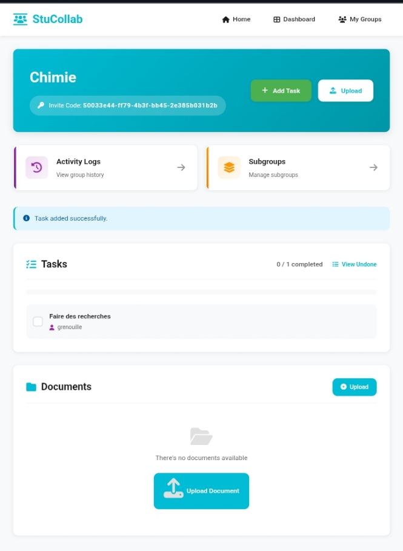
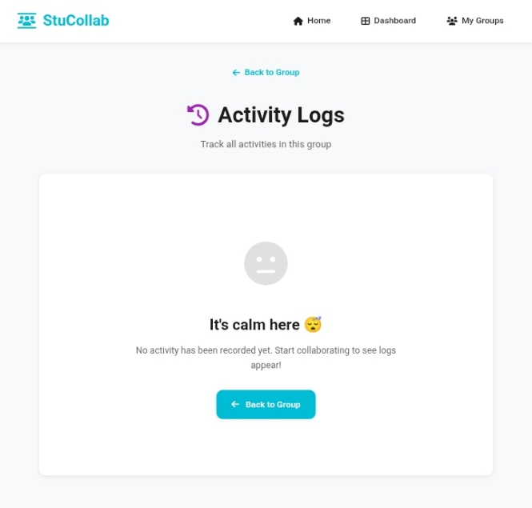

# Espace de Collaboration Étudiant

## Description

Ce projet permet aux étudiants de collaborer efficacement en ligne sur des tâches et fichiers. L’application facilite la gestion de projets de groupe, avec des fonctionnalités permettant de diviser le travail, assigner des responsabilités et partager des fichiers.

## Aperçu





## Fonctionnalités

- **Gestion des tâches** : Créez des tâches, assignez-les à des membres du groupe, et suivez leur progression.
- **Sous-groupes** : Organisez les membres en sous-groupes pour mieux répartir les responsabilités et organiser le travail.
- **Upload de fichiers** : Partagez facilement des documents, fichiers, et autres ressources au sein du groupe.
- **Interface collaborative** : Une plateforme simple et intuitive pour gérer tous les aspects de votre projet de groupe.

## Technologies utilisées

- **Backend** : Django (Python)
- **Frontend** : HTML, CSS
- **Base de données** : SQLite ou PostgreSQL (selon vous)
- **Stockage de fichiers** : Utilisation de stockage local (comme MinIO) ou d’un service cloud (comme AWS S3) pour les fichiers.

## Installation

1. Clonez le projet sur votre machine locale :
   `https://github.com/StuCollabo/StudCollab.git`
2. Installez les dépendances :
`~pip install -r requirements.txt`

3. Configurez la base de données (PostgreSQL):
```
python manage.py migrate
```

4. Lancez le serveur de développement :
```
python manage.py runserver
```


Contribuer

Si vous souhaitez contribuer à ce projet, n’hésitez pas à ouvrir une pull request avec vos améliorations ou corrections. Vous pouvez aussi signaler des problèmes via les issues.
